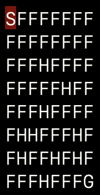

Implementing various algorithms in a toy [environment](https://gym.openai.com/envs/FrozenLake-v0/) from OpenAI Gym. Modelling the environment as a Markov Decision Process, Value / Policy iteration is used when an exact model of the environment is known (transition probabilities), and Temporal difference / Q-learning when we do not have this model.

Environment: 

- S represents the start state, F is a state the agent can use to continue towards the goal state G, and H represents a 'hole' state, and ends the iteration.
- The current state is highlighted in red.
- The files vi_and_pi.py, and mc_td_and_qlearning.py respectively contain the methods used to run the environment, and you can change the various parameters there.

